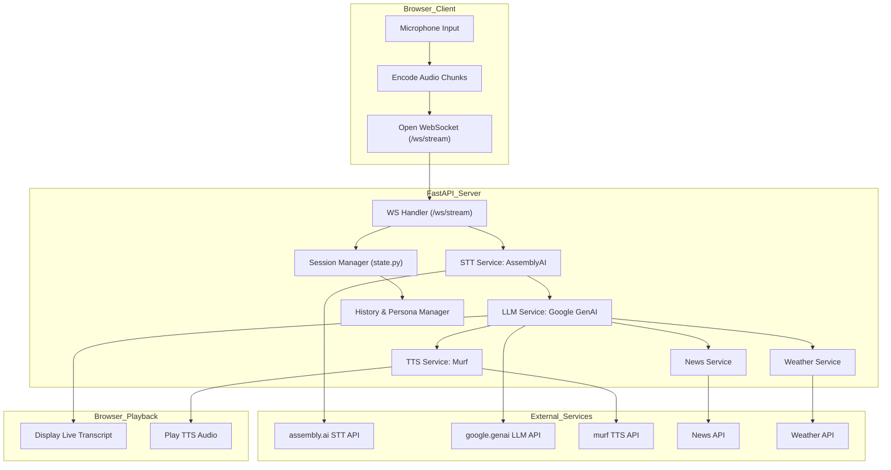
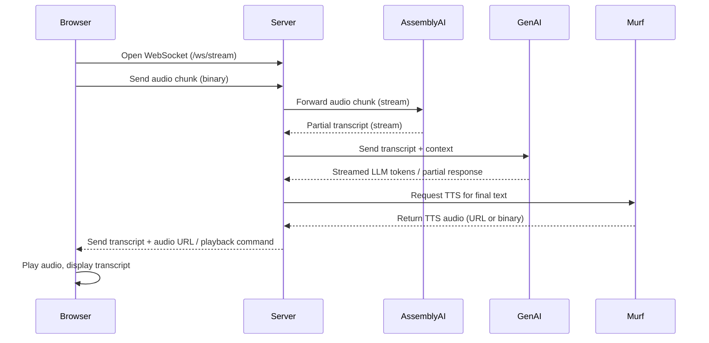

# 🎙️ Dexter AI — Streaming Voice Agent

 

**Dexter AI** is a persona-driven, real-time **streaming voice agent**. It listens to your microphone, understands you through **speech-to-text (STT)**, reasons with an **LLM**, and replies with **text-to-speech (TTS)** — all in real time. Default persona: *Dexter Morgan*.

It’s built on **FastAPI** with a clean, modular service design. Beyond conversations, it can fetch **news**, **weather updates**, and handle **file uploads & transcriptions**.

---

## 📑 Table of Contents
- [Project Summary](#project-summary)
- [Key Functionalities](#key-functionalities)
- [Architecture](#architecture)
- [Sequence Diagram](#sequence-diagram)
- [Technologies](#technologies)
- [Features & Endpoints](#features--endpoints)
- [Running Locally](#running-locally)
- [Future Improvements](#future-improvements)

---

## Project Summary
Dexter AI demonstrates a modern streaming assistant pipeline:
1. **Browser Client** captures microphone audio and streams it to the server via WebSocket.
2. **FastAPI Server** orchestrates STT (AssemblyAI), LLM (Google GenAI), and TTS (Murf), plus news/weather lookups.
3. **Client Playback** receives live transcripts and audio replies for playback.

---

## Key Functionalities
- Real-time speech streaming via WebSocket
- Streaming STT with AssemblyAI
- LLM-powered conversational responses (Google GenAI)
- TTS replies via Murf
- NewsAPI & WeatherAPI integrations
- Session-based API keys and persona state
- File upload and offline transcription endpoints
- Browser client with microphone capture and playback

---

## Architecture

### Detailed Flow


---

## Sequence Diagram
Use this mermaid sequence diagram to show step-by-step message exchange. Paste into a fenced `mermaid` block in your README.



---

## Technologies
- Backend: FastAPI, Uvicorn, AsyncIO, WebSockets
- LLM: Google Generative AI (Gemini)
- STT: AssemblyAI
- TTS: Murf
- Integrations: NewsAPI, WeatherAPI
- Client: HTML + JS (WebSocket streaming, mic capture)
- Tools: dotenv, aiohttp/httpx

---

## Features & Endpoints

### WebSocket
- `ws://<host>/ws/stream` → real-time pipeline (mic → STT → LLM → TTS).

### REST Endpoints
- `/upload` → upload audio file
- `/transcribe/file` → offline transcription
- `/api/weather?city=London` → fetch weather
- `/api/news?country=us` → fetch news
- `/history/{session_id}` → get chat history
- `/debug/*` → debugging endpoints

---

## Running Locally

### Setup
```bash
# 1. Clone repo
git clone <repo_url>
cd Dexter-AI

# 2. Create virtual env
python -m venv venv
source venv/bin/activate   # macOS/Linux
# venv\Scripts\activate   # Windows

# 3. Install requirements
pip install -r requirements.txt

# 4. Setup env vars (.env)
cp .env.example .env
# Add your API keys (ASSEMBLYAI, MURF, GEMINI/GENAI, NEWSAPI, WEATHER_API)

# 5. Run server
uvicorn main:app --reload --port 8000

# 6. Open in browser
http://localhost:8000/
```

Notes:
- Ensure your `.env` includes valid API keys.
- For production, consider using a process manager (gunicorn/uvicorn workers) and a persistent store (Redis) for session state.

---

## Future Improvements
- Persistent storage for session history
- Secure API key management (vault/encryption)
- Scalability (worker queues, rate limiting)
- UI improvements (voice selection, rate/pitch control)
- CI/CD and tests

---

## License
MIT License — free to use, modify & share
